# CrowdSource

## Hierarchy

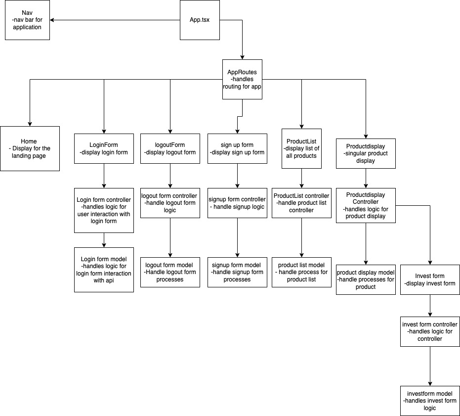

In the project directory, you can run:

### `npm start`

Runs the app in the development mode.\
Open [http://localhost:3000](http://localhost:3000) to view it in the browser.

The page will reload if you make edits.\
You will also see any lint errors in the console.

##User flow

##MVC
The MVC framework is a architectural pattern that separates an application into three parts: Model View and Controller. It helps simplify the software by dividing it into 3 distinct parts that you can build, test, and maintain independently. the model holds the information about how to use the data controller manipulates the data and the view presents it all to the user.

###Homepage pre login
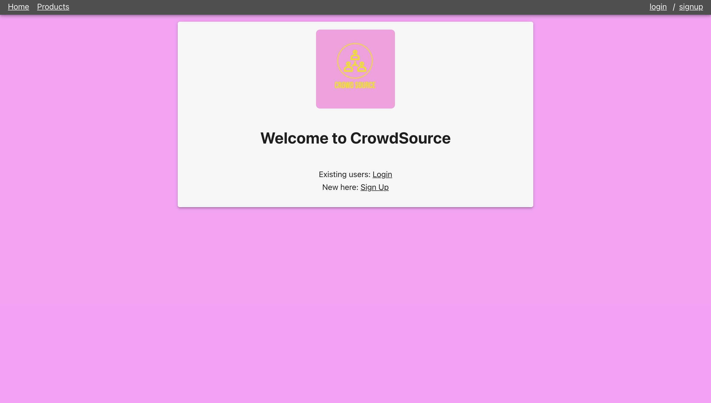
###login
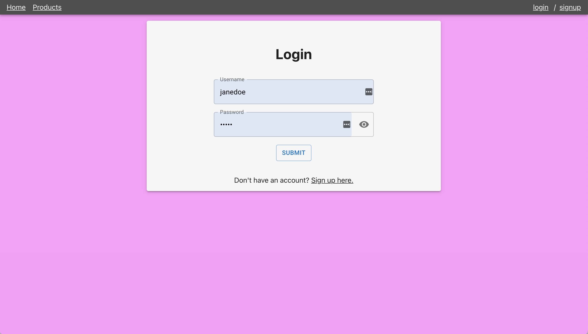
###homepage after login
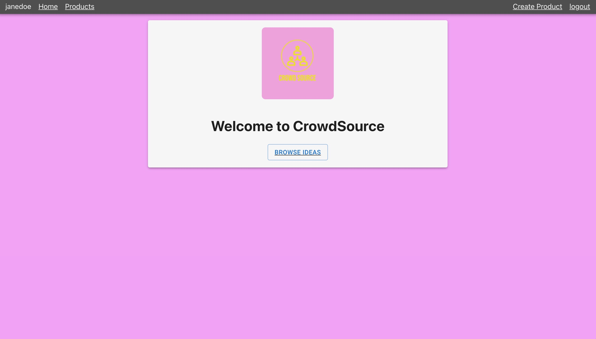
###sign up form
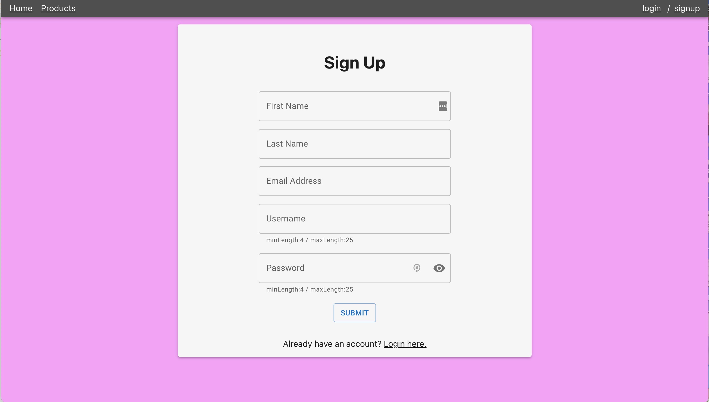
###stripe authorization
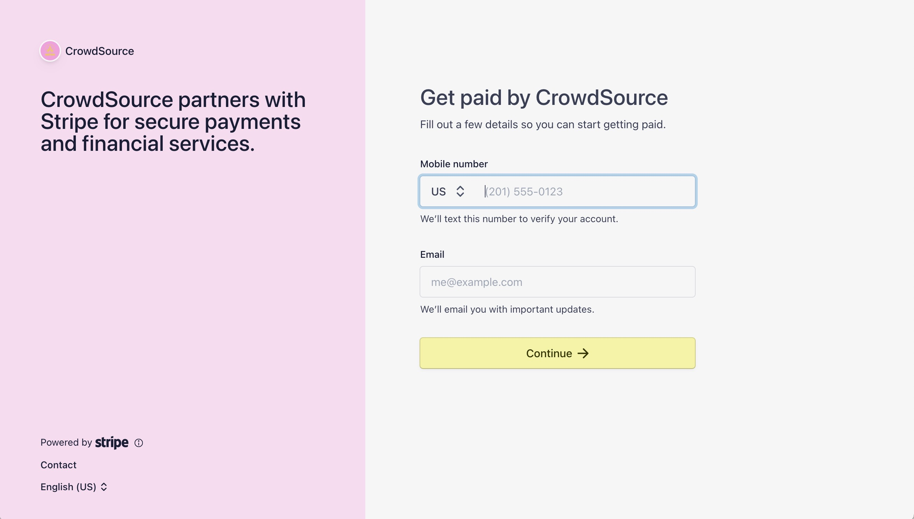
###product list display
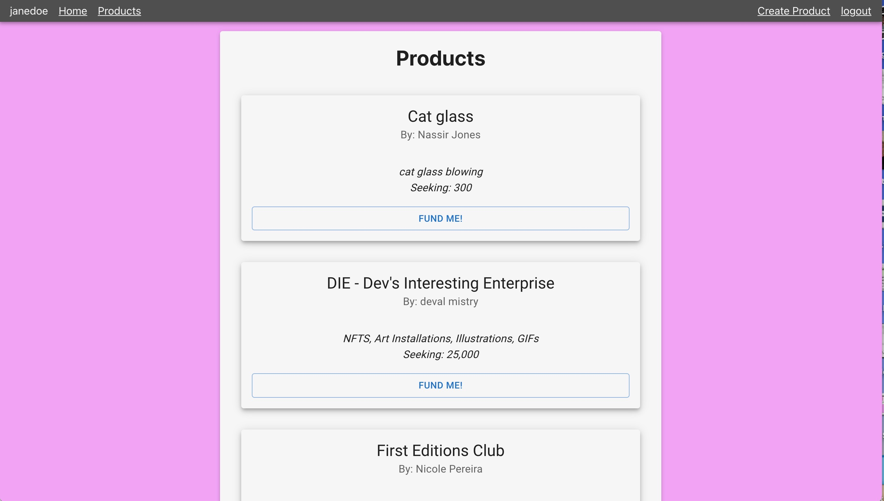
###add product form
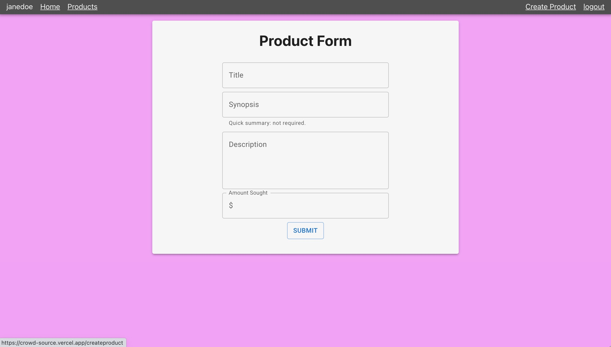
###filled product form
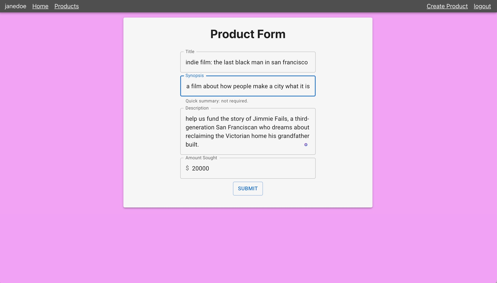
###product form submission
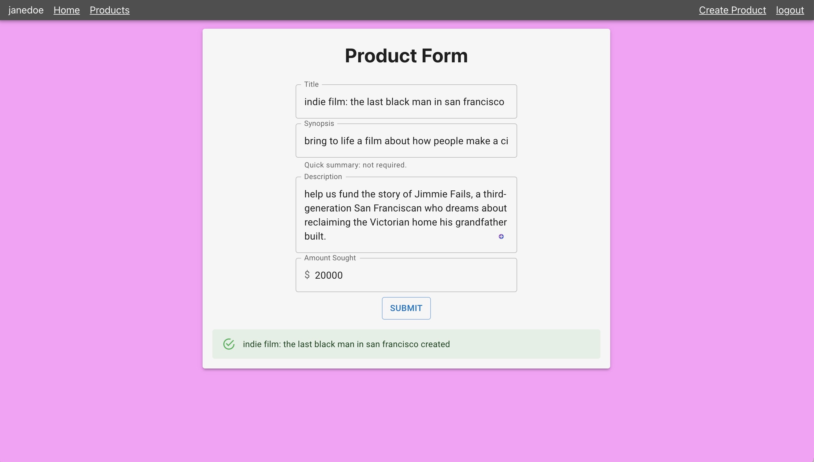
###product display
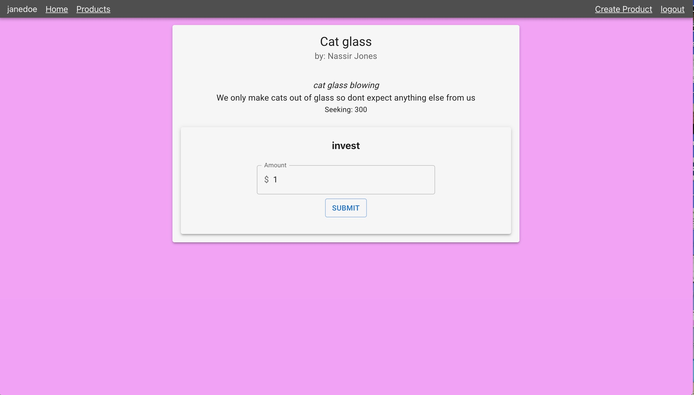
###payment page
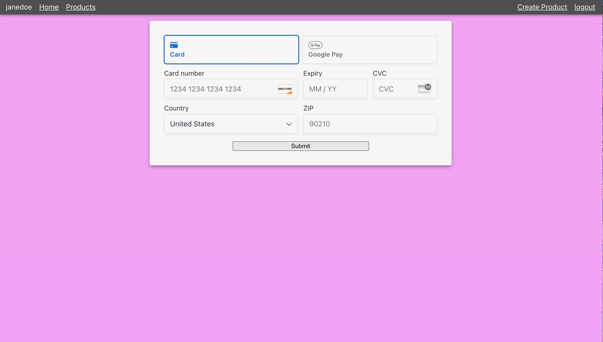
###failed login
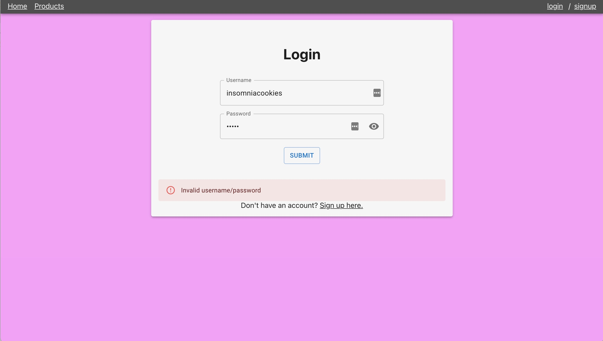
###logout page
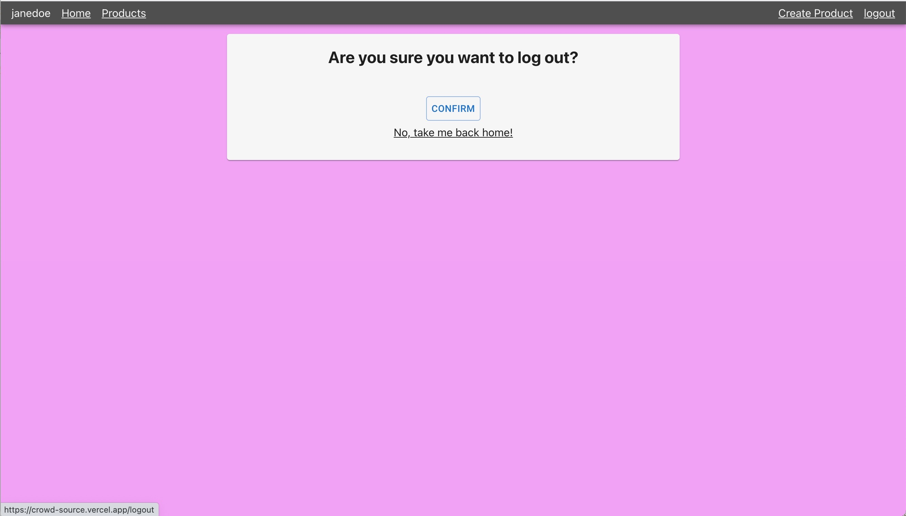

##Use it live
[live link](https://crowd-source.vercel.app/)

##My backend is located at
[backend files](https://github.com/nasjones/crowdSource-backend)